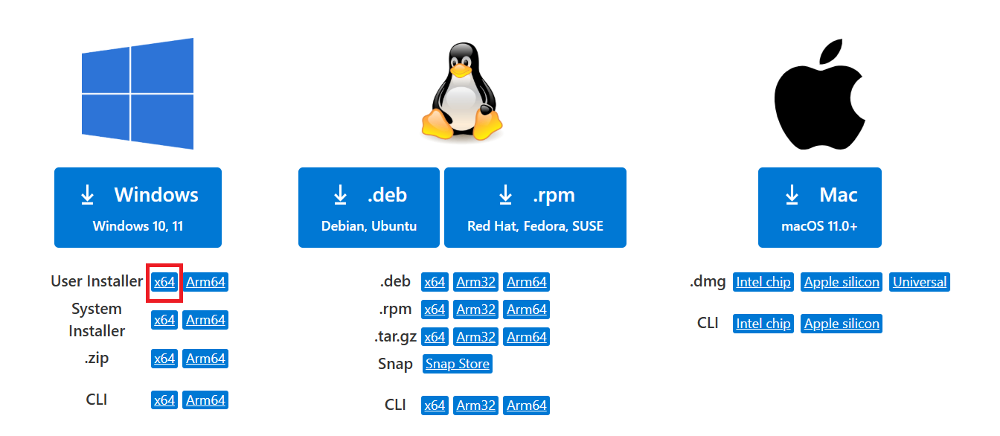
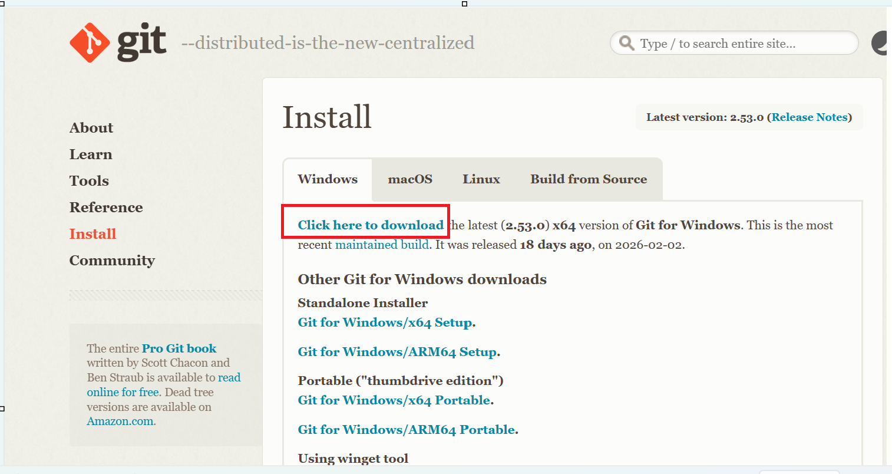

# 🛠️ Installation Guide

Step-by-step instructions to install tools on Windows.

---

## Prerequisites

- Windows 10 (64-bit) or Windows 11
- Administrator access on your machine
- Stable internet connection

---

## 1. 📝 Visual Studio Code

### Download
1. Go to **[https://code.visualstudio.com/download](https://code.visualstudio.com/download)**
2. Click **Windows** (the large blue button) to download the installer (`.exe`)



### Install
1. Run the downloaded file (e.g., `VSCodeSetup-x64-x.xx.x.exe`)
2. Accept the license agreement → Click **Next**
3. Choose install location → Click **Next**
 Click **Next** → **Install** → **Finish**

---

## 2. 🐙 Git

### Download
1. Go to **[https://git-scm.com/download/win](https://git-scm.com/download/win)**
2. The download should start automatically for the latest 64-bit installer




### Initial Configuration
After installation, configure your identity:
```bash
git config --global user.name "Your Name"
git config --global user.email "your.email@example.com"
```

---

## 3. 🐳 Docker Desktop *(Manual Install — Required Prerequisite)*

> ⚠️ **Docker Desktop is NOT installed automatically by the setup script.** You must install it manually before running the project.

> **Note:** Docker Desktop requires Windows 10/11 with WSL 2 (Windows Subsystem for Linux) enabled.

### Step 1 — Enable WSL 2 (if not already done)
Open PowerShell **as Administrator** and run:
```powershell
wsl --install
```
Restart your computer when prompted.

### Step 2 — Download Docker Desktop
1. Go to **[https://www.docker.com/products/docker-desktop](https://www.docker.com/products/docker-desktop)**
2. Click **Download for Windows**
3. Run the installer and follow the prompts
4. Launch Docker Desktop and wait for it to fully start (whale icon in system tray stops animating)

### Verify Docker
```powershell
docker --version
docker run hello-world
```


## 4. 📂 Open VS Code & Clone the Repository

Now that the core tools are installed, the next step is to get the project files onto your machine.

### Step 1 — Open VS Code
1. Press **Win** key and search for **Visual Studio Code**, then open it

### Step 2 — Open the Integrated Terminal
Inside VS Code, open the integrated terminal:
- Go to **Terminal → New Terminal** from the top menu

A PowerShell terminal will open at the bottom of VS Code.

### Step 3 — Navigate to Your Working Folder
Choose a folder where you want to store the project, then navigate to it:
```powershell
# Example: go to your Documents folder
cd C:\Users\<YourUsername>\Documents
```

### Step 4 — Clone the Repository
Run the following command to clone the project:
```bash
git clone https://github.com/leadwithnav/genai-training.git
```

Once cloned, navigate into the project folder:
```bash
cd genai_training
```

### Step 5 — Open the Project in VS Code
Open the cloned folder directly in VS Code:
```bash
code .
```
VS Code will reload with the project files visible in the **Explorer** panel on the left.

---

## 5. ⚙️ Run the Setup Script

The project includes a PowerShell script (`setup/windows/install_tools.ps1`) that automatically installs all remaining testing tools: **Node.js, Python, Java, Postman, Playwright, Locust, and JMeter**.

Inside Terminal

```powershell
# Navigate to the project root first
cd C:\Users\<YourUsername>\Documents\genai_training\setup\windows

# Run the full setup script
./install_tools.ps1
```

The above script will install the following tools:

| Tool          | Installed                 |
|---------------|---------------------------|
| `Node.js`     | Node.js LTS               |
| `NPM`         | Included with Node.js     |
| `Python`      | Python 3.11               |
| `Java`        | Java JDK 17               |
| `Postman`     | Postman (GUI app)         |
| `Playwright`  | Playwright + Chromium     |
| `Locust`      | Locust (Python)           |
| `JMeter`      | Apache JMeter 5.6.3       |

> **Note:** Docker Desktop is **not** installed by this script — see Section 3 for manual install steps.

### Verify your tool installations

After the script finishes, run the verification script to confirm everything is working:

```powershell
.\verify_tools.ps1
```

---